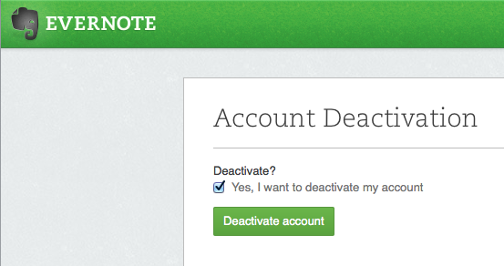

So, I've decided to wave a less-than-fond farewell to <a href="http://www.evernote.com/">Evernote</a>. I've been a paid subscriber since 2011 but I no longer use it as much as I did. The software clients are bloated and the company seems more interested in selling additional services rather than fix fundamental problems such as copy and paste in plain text.

Well, no more I say, I've moved to <a href="http://www.simplenote.com/">SimpleNote</a> and <a href="http://brettterpstra.com/projects/nvalt/">nvAlt</a>. To migrate my notes, I processed my:

<ul>
<li><strong>plain text files</strong> using <a href="http://steady.org/2013/06/19/exporting-evernote-notes-to-plain-text-files-part-1/">this post on exporting Evernote files to plain text</a> for inspiration, I wrote a ruby script to convert each individual note into a plain text file, reversed the HTML into Markdown and imported in nvAlt. It sort of worked but not really, I had to make some manual checks to ensure I didn't lose anything.</li>
<li><strong>files with attachments</strong>: I waded through 100 or so of these to check if they were worth keeping. Most weren't. I converted those that were into PDF's ready for processing.</li>
</ul>

After checking all notes I expected to see was were in nvAlt, I deleted the Evernote clients from my phone, iPad &amp; Mac and then deactivated my account. 

Onwards and upwards I say.

