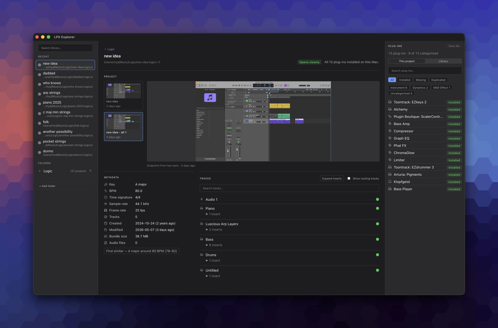

I've got way too many Logic Pro projects with unhelpful titles like "new idea", "new idea 2" and "3 tracks copy". Opening each one in Logic just to remember what's inside takes forever and I've run into the "the plugin X isn't installed" problem far too many times.

I couldn't take it anymore so I built **[LPX Explorer](https://github.com/rhydlewis/lpx-explorer)**: a read-only macOS app that opens `.logicx` projects and shows you what's inside without launching Logic.

## Why I Built It

Logic's `.logicx` projects are a mix of binary and audio files. This means I can't answer simple questions like "will this project open cleanly on my Mac?" or "what does this old project actually contain?" without launching Logic and waiting for the app to load. It should be a one-second answer, not a 30-second wait.

Also, since the `.logicx` file format has zero public documentation (AFAIK), I quite liked the idea of digging into a binary format that [isn't well understood outside of Apple](https://www.logicprohelp.com/forums/topic/132829-internal-logic-pro-x-file-format-docs/).

## What It Does

LPX Explorer reads one or more `.logicx` bundles and shows you:

- Project metadata (key, BPM, time signature, sample rate, dates, size)
- An audio preview of the files in the project
- The tracks and plug-ins used
- Which plug-ins are missing on your Mac
- Similar projects by key or BPM
- Plug-in usage across your whole library, useful when asking "which project used that random synth from 2016?"

The app helps answer these 'jobs-to-be-done':

- **"Will this project open cleanly on this Mac?"** The Inventory tab cross-references the project's plug-ins against your local Audio Unit registry and a banner names anything missing. One-second answer.
- **"Find the project I half-remember."** Search across the project grid; chips show key, BPM, tracks, size and modified time so you can scan past the five identically-named cards.
- **"Which of my plug-ins do I actually use?"** A roll-up aggregates plug-in usage across every project. Useful for cutting dead-weight licence costs.
- **"Is this plug-in installed and signed?"** Version, codesign authority and `.aupreset` count per AU; flags unsigned or old plug-ins that explain a load failure on a stricter macOS.

## Reverse-Engineering Without Breaking Things

Each Logic project contains a `ProjectData` binary file. Working with a hex editor and Claude Code, the loop I went through to identify aspects of this file included:

1. Form a hypothesis
2. Hex-dump the project
3. Write a test
4. Tighten the parser
5. Move to the next pattern

Four-character tags like `umua`, `gRuA`, `OCuA`, `karT` act as anchors within the file. Using these, I could read the bytes either side. Messy but it works. Almost all of this was built with Claude Code as a pair-programmer, with most of my time spent on reviewing plans and decisions rather than coding.

Some things I've not been able to solve: working out the UI track-row order and the bridge between regions & channel strips.

Since every `.logicx` contains creative work I don't want to lose (well, '3 tracks copy' is rubbish but...), I wanted to ensure the app could not modify a `.logicx` project. So I added a before-and-after check to ensure that every file's bytes and `mtime` (modified time) are unchanged after parsing. If that test fails, the build fails.

## CLI First, App Second

I started with a CLI toolkit. It worked fine for me but it was useless to the non-engineer musicians who have exactly the same problem. So I rewrote the Python parser in Rust and built a macOS app using the Tauri framework. The CLI is still there if you want it.

## Who It's For

Me, first and foremost. I have hundreds of Logic projects and many of them are one-off sketches or ideas I've thrown together then forgotten what's in which. [Other Logic Pro users](https://www.reddit.com/r/LogicPro/comments/1tfyyj0/i_built_an_app_to_see_whats_in_logic_projects/) [seem to like it too](https://www.reddit.com/r/Logic_Studio/comments/1tgsjm7/i_got_tired_of_waiting_for_logic_to_open_just_to/).

## Caveats

It's an early release (v0.0.7) so please use at your own risk. The parser is reverse-engineered and there are still gaps: not all track names parse correctly, hidden vs visible tracks aren't yet distinguished and tracks don't display in Logic's UI order. However, I'm finding it really useful for digging into old projects.

## Try it

- Installer: [github.com/rhydlewis/lpx-explorer/releases](https://github.com/rhydlewis/lpx-explorer/releases)
- Repo: [github.com/rhydlewis/lpx-explorer](https://github.com/rhydlewis/lpx-explorer)

I'd love feedback, especially on edge cases: unusual project setups, third-party plug-in detection quirks, anything else that surprises you.
