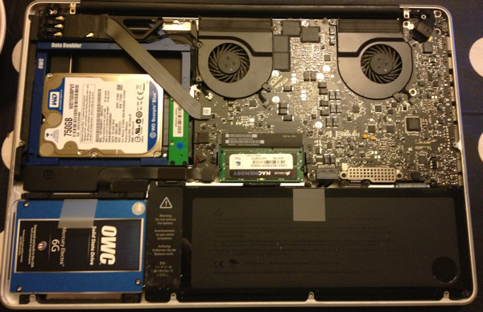

My early 2011 15" MacBook Pro has been somewhat sluggish of late. Apps such as iTunes, Mail and Office take 10+ seconds to open and the whole system feels a second or two behind me. Possible cause is the factory-installed Toshiba hard disk which has given me grief for the last 6 months or so (too many bad sectors, corrupted data not fixable by Disk Utility) so I've made the switch to an SSD. I also decided to upgrade the RAM from 8GB to 16GB since RAM is cheap.

<h2 id="preinstall">Pre-install</h2>

I decided to install an SSD as the startup drive to host the OS and applications. A large SSD is expensive and I need more space than an affordable drive for music, photos, movies and so on. Since I rarely use the DVD drive, OWC's Data Doubler kit allows you to replace it with a 2nd drive. I chose:

<ul>
<li><a href="http://eshop.macsales.com/item/OWC/DDMBSSD240/">OWC Data Doubler 240GB 6G SSD Drive Bundle</a></li>
<li><a href="http://wdc.com/en/products/products.aspx?id=800">Western Digital 750GB HDD</a></li>
</ul>

<a href="http://eshop.macsales.com/installvideos/macbookpro_15_unibody_early11/">OWC's step-by-step HOWTO videos</a> showed that doing the upgrade yourself isn't at all difficult.

<h2 id="install">Install</h2>

I wrote a 500 word upgrade plan detailing every last screw change (due to immense paranoia that I would brick my laptop). Digested form:

<ol>
<li>Clone existing Toshiba HDD to external USB drive using <a href="http://www.bombich.com">Carbon Copy Cloner</a></li>
<li>Remove existing HDD and replace with SSD (<a href="http://eshop.macsales.com/installvideos/macbookpro_15_unibody_early11_hd_h/">OWC video</a>)</li>
<li>Remove existing optical drive and replace with new HDD (<a href="http://eshop.macsales.com/installvideos/macbookpro_15_unibody_early11_dd/">OWC video</a>)</li>
<li>Restart Mac from cloned drive</li>
<li>Format 2 new drives using Disk Utility</li>
<li>Clone recovery partition onto SSD using Carbon Copy Cloner's <a href="http://www.bombich.com/software/docs/CCC/en.lproj/advanced-strategies/the-disk-center.html">Disk Centre</a></li>
<li>Clone OS and user directory from external drive to SSD (ignoring large files such as music, pictures, etc.)</li>
<li>Shut down Mac, disconnect external drive</li>
<li>Cross fingers, start Mac</li>
</ol>

And, lo and behold: it worked. I logged in, reconnected the external drive and set up another clone job to run overnight and move all the missing large files onto the internal HDD.

<h2 id="postinstall">Post-install</h2>

I decided to keep my users folder on the SSD rather than move it onto the HDD to make as much advantage of the speed increase as possible. This meant that I needed to check a few apps:

<ul>
<li><strong>iTunes</strong> - started in under a second (!) and worked without any problems after I updated the iTunes library location to <em>/Volumes/Data/rhyd/Music/iTunes/iTunes Media/</em></li>
<li><strong>iPhoto</strong> -  started in a few seconds (a massive improvement) after double clicking on the iPhoto Library folder in <em>/Volumes/Data/rhyd/Pictures/</em></li>
<li><strong>Dropbox</strong> - moved the Dropbox folder from <em>/Users/rhyd/Dropbox</em> to <em>/Volumes/Data/rhyd/Dropbox/</em> and copied the contents of the cloned Dropbox folder into this (to prevent Dropbox downloading everything from the server)</li>
</ul>

<h2 id="observations">Observations</h2>

After a week of using my Mac:

<ul>
<li>it is fast, very fast. In fact, it feels like a new machine</li>
<li>logging in takes about 5s before the Mac is usable (last week it was > 30s)</li>
<li>apps start just. like. that (<em>snaps fingers</em>)</li>
<li>cold startup is quicker but nowhere near as quick as a new MacBook Pro 13 with Retina</li>
</ul>

I fixed a couple of minor issues that I hadn't anticipated:

<ul>
<li>Office 2011 doesn't like it if you change hard drives. Re-activiation needed.</li>
<li>TextExpander started before I'd finished setting up Dropbox again so it overwrote my settings file with the defaults - easily fixed though using a previous version from Dropbox</li>
<li>Some sym links to Dropbox files were broken (e.g. some useful Ruby scripts) and needed updating</li>
<li>Backblaze didn't like that my old HDD was missing (fair enough). I have to upload everything to them again. Would be good if you good tell them to move data you've already uploaded.  </li>
<li>The system clock reset itself to Jan 1 2001 after I restarted using the cloned external drive (assuming because I'd disconnected the battery (?) for longer than expected). Resulted in some folders showing a modification date on Jan 1st. Odd</li>
</ul>
  

