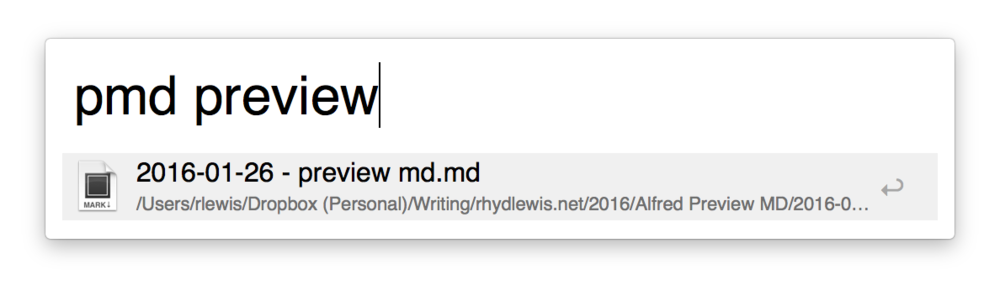
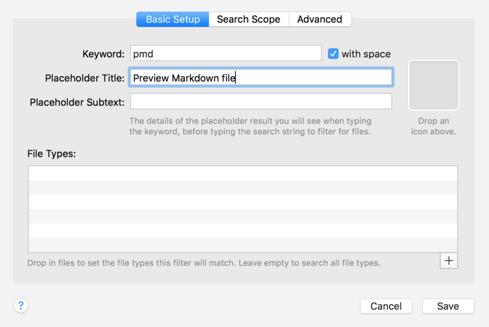

I use [Markdown](http://daringfireball.net/projects/markdown/) whenever I'm writing or making notes. Depending on what I'm writing, I use either [Sublime Text](http://www.sublimetext.com), [Byword](http://bywordapp.com/) or [nvAlt](http://brettterpstra.com/project/nvalt/) as the text editor. In most cases, it's Byword for longer pieces, nvAlt for notes and Sublime for shorter pieces.

Seeing the rendered text side-by-side is often useful too. I've created this Alfred workflow to help me open any Markdown file in [Marked](http://marked2app.com) (a fantastic preview tool written by the author of nvAlt).

To use it, I open Alfred (`⌘-Space`) and type `pmd`.
  
 

then type a query to find the file I want to see:

Which means I can do split my screen and see my changes as I make them:
  

Here's a step-by-step guide on how to create this workflow:

* Open Alfred Preferences and create a new workflow
* Add a <em>File Filter</em> input with set the keyword as `pmd`
  

  
* From the Finder, drag a Markdown file into the File Types box to ensure Alfred only shows Markdown files in the results
  

* Add an <em>Open File</em> action and drag in Marked.app (or whatever app you want to use) from the `Applications` folder
  

Link the input to the action and you're done!
  

