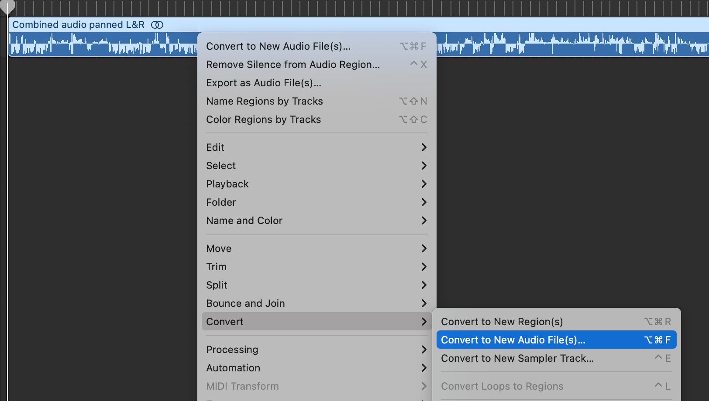
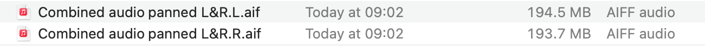

I made an audio recording of a Zoom conversation using Rogue Amoeba's superlative [Audio Hijack](https://rogueamoeba.com/audiohijack/) recently. I rushed into it and didn't check how Audio Hijack processed and saved the audio. By default, it created 3 files:

1. an interleaved, stereo file for both people
2. my audio only (mono)
3. an interleaved, stereo file for both people (except with 1 person panned left and the other panned right)

Needing 2 separate files (1 for me, 1 for the other person) a sinking feeling occurred as I incorrectly assumed that file 3 was the same as the file 1. After importing the files into Logic Pro, I spotted a quick way out thanks to Logic's Convert function:

1. Right click on the audio track and choose **Convert > Convert to New Audio File(s)...** from the context menu (or hit ⌘-⌥-F)

2. Choose _Interleaved to Split_ as the **Stereo Conversion** option and hit **Save**

3. Wait for a moment...
4. Done!

Panic over.
