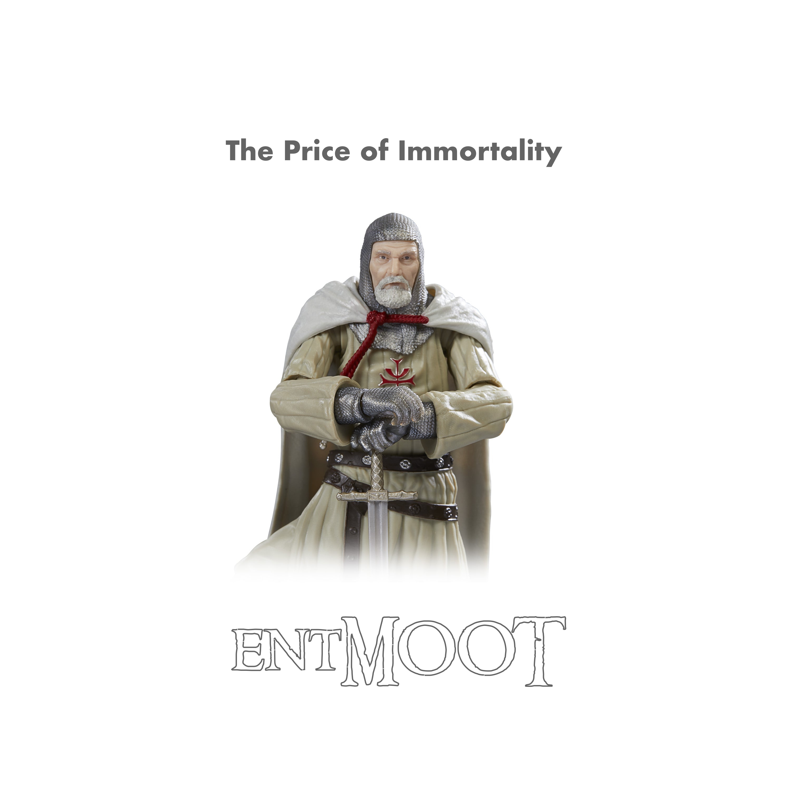

In the last couple of years, I've found myself spending more time tinkering with musical ideas in Logic Pro that combine synthesisers, guitar and movie dialogue. I find time spent experimenting in this way extremely cathartic. I've been working on a new entMOOT song recently called "The Price of Immortality".

It's a interesting combination of the usual synths, guitar and drums but, for this one, I threw in a church organ as well which I think works well. The song is  based around this repeating progression that I started playing on guitar initially - albeit the Fmaj7 with no 3rd and a bass E I think is a suggestion from Scaler2:

`Em - Am - F - Dm - G - Em7 - F maj7(no3)/E - G/B`

Overlaid onto the music, I'm incorporating dialog from one of the best scenes from Indiana Jones & The Last Crusade: Indy, Elsa and Donavan meeting the Grail Knight. "He chose... _poorly_..."

The rough mix is ready, I just need to work through it a little more. I've enjoyed creating this one.

